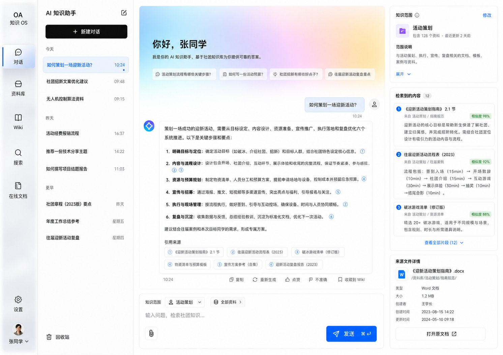

# OpenAtom Knowledge OS

AI 驱动的社团知识操作系统，提供文件管理、RAG 知识问答、在线文档、Wiki、全文搜索、RBAC 和 Electron 桌面端。



## 技术栈

- 后端：Spring Boot 3.5、Java 17、JPA、Flyway
- 桌面端：Electron、Vue 3、Vite、Pinia、TypeScript
- 组件库：`@openatom/ui`
- 数据：MySQL、Redis、MinIO、Elasticsearch
- 认证：OAuth2 / OIDC Authorization Code + PKCE
- 文件解析：Apache Tika

## 目录

```text
.
├── backend/
├── desktop/
├── packages/ui/
├── docker/
├── docs/
└── .github/workflows/
```

## 快速开始

### 1. 安装前端依赖

需要 Node.js 22 和 pnpm 11：

```bash
pnpm install
```

### 2. 启动本地后端

本地模式使用 H2 文件数据库、本地文件目录和模拟 AI，无需 Docker：

```bash
./mvnw spring-boot:run
```

后端地址：

```text
http://127.0.0.1:8080
```

### 3. 启动桌面端

```bash
pnpm dev
```

仅浏览器预览：

```bash
pnpm dev:web
```

浏览器预览登录页提供“进入本地演示模式”。

## 完整基础设施

```bash
cp docker/.env.example docker/.env
docker compose -f docker/docker-compose.yml up -d --build
```

服务：

| 服务 | 地址 |
| --- | --- |
| 后端 | `http://localhost:8080` |
| MySQL | `localhost:3306` |
| Redis | `localhost:6379` |
| MinIO API | `http://localhost:9000` |
| MinIO Console | `http://localhost:9001` |
| Elasticsearch | `http://localhost:9200` |

## 配置 OAuth 客户端

认证中心：

```text
https://oauth.jmi-openatom.cn/api/v1
```

注册公开客户端：

```text
Client ID: openatom-knowledge-desktop
Redirect URI: http://127.0.0.1:47832/auth/callback
Scopes: openid profile email roles permissions
Grant Types: authorization_code refresh_token
Client Secret: 留空
```

如需修改：

```bash
OPENATOM_OIDC_CLIENT_ID=your-client-id pnpm dev
```

Electron 主进程生成并校验 PKCE，令牌使用系统安全存储保存。

## 配置真实 LLM

后端支持 OpenAI 兼容接口，内置 `openai-compatible` 与 `deepseek` 两个 provider。未配置时使用确定性的本地回答器，所有页面仍可运行。

### 接入 DeepSeek

DeepSeek 提供 OpenAI 兼容接口，无需改代码，通过环境变量即可启用：

```bash
AI_PROVIDER=deepseek
AI_API_KEY=sk-your-deepseek-key
# 以下两项可省略，后端会自动使用 DeepSeek 默认值
# AI_BASE_URL=https://api.deepseek.com
# AI_MODEL=deepseek-chat
```

可选模型：

| 模型 | 说明 |
| --- | --- |
| `deepseek-chat` | DeepSeek-V3，通用对话（默认） |
| `deepseek-reasoner` | DeepSeek-R1，深度推理 |

启动后端：

```bash
AI_PROVIDER=deepseek AI_API_KEY=sk-xxx ./mvnw spring-boot:run
```

### 接入 OpenAI 兼容接口

```bash
AI_PROVIDER=openai-compatible
AI_BASE_URL=https://api.openai.com/v1
AI_API_KEY=your-key
AI_MODEL=gpt-4.1-mini
```

## 构建

```bash
pnpm build
./mvnw clean package
```

桌面安装包：

```bash
pnpm build:desktop
```

## 文档

- [组件库开发文档](docs/component-library.md)
- [技术设计](docs/technical-design.md)
- [API 文档](docs/api.md)
- [CI/CD 需求原文](CODEX.md)
- [视觉设计系统](DESIGN.md)

## 发布

推送版本标签后，GitHub Actions 自动构建后端 JAR、macOS DMG 和 Windows NSIS 安装包：

```bash
git tag v1.0.0
git push origin v1.0.0
```

macOS 暂未配置 Apple Developer 签名证书，因此不启用自动更新；macOS 用户通过 Release 下载 DMG 手动覆盖安装。
